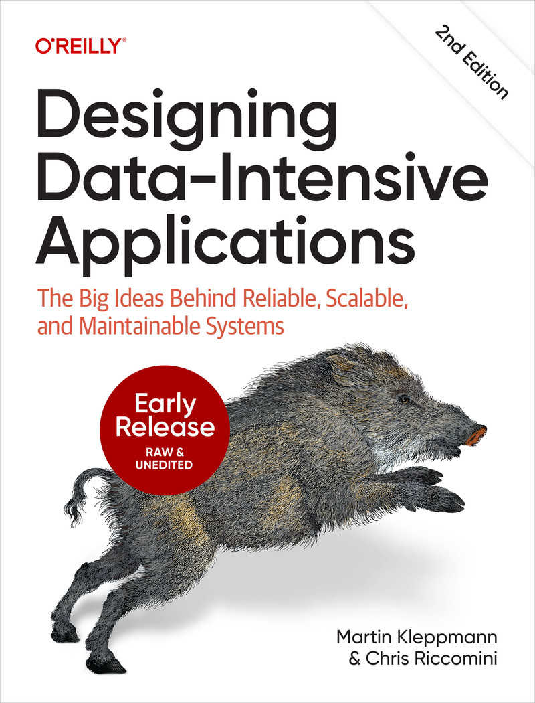

<!-- header: "" -->
# There's No 'I' in Team, But There Is In ACID
a small guide to database isolation levels

Giorgio Vilardo
Voxy DevMeeting
December 3, 2025

---

## Today's agenda

- What is ACID ?
- How Isolation solves certain problems
- Other concurrency tools
- Framework defaults
- Demo
- Further reading

---

<!-- header: "What is ACID ?" -->
## ACID

ACID is an acronym that stands for Atomicity, Consistency, Isolation, and Durability. These are a set of properties of database transactions intended to guarantee data validity despite errors, power failures, and other mishaps.

ACID compliance is a very valuable thing for a DBMS to have, but it can be traded off if you don't REALLY need it. That's the choice of some DBMS that are usually used in write-heavy, non critical scenarios (think Cassandra, Dynamo, etc., for e-commerce carts).

---

## **A**tomicity

This property ensures that a transaction is treated as a single, indivisible unit of work. Either all of its operations are executed, or none of them are. If any part of the transaction fails, the entire transaction is rolled back, and the database is left unchanged.

## **C**onsistency

This ensures that a transaction can only bring the database from one valid state to another. It prevents any data from being written that would violate the database's rules and constraints.

---

## **I**solation

Isolation determines how and when changes made by one transaction become visible to others. It ensures that concurrent transactions do not interfere with each other, preventing data corruption.

## **D**urability

This property guarantees that once a transaction has been committed, it will remain committed, even in the event of a system failure like a power outage or crash.

---

## Is this important to us?

ACID compliance is crucial for maintaining data integrity and reliability, especially in mission and business critical flows, but for the average developer in the average company, Atomicity and Isolation are the most important aspects to know.

Atomicity is generally well understood; open a transaction with `BEGIN` and `COMMIT` when done. Otherwise `ROLLBACK`.

Let's take a deeper look at Isolation instead, which is critical to enable concurrency.

---

<!-- header: "How Isolation solves certain problems" -->
## Known isolation problems

When multiple transactions run concurrently without proper isolation, several data anomalies can occur:

- Dirty Read
- Non-repeatable Read
- Phantom Read

It's easier to see these data problems when under big concurrent load, but they can also appear with very slow processes (i.e. open a transaction, wait for an API call, write and close the transaction).

<!-- keep transactions short! If you need to do stuff that can fail after a db update, use the Outbox pattern!* -->

---

### Dirty Read

A transaction reads data that has been modified by another transaction but has not yet been committed. If the modifying transaction rolls back, the first transaction will have read data that never officially existed.

**Example:** Transaction 1 updates a product's price. Transaction 2 reads the new, uncommitted price. If Transaction 1 rolls back, Transaction 2 has used an incorrect price.

---

### Non-Repeatable Read

A transaction reads the same row twice and gets different data each time because another transaction has modified that row in between the reads.

**Example:** Transaction 1 reads a product's stock level. Transaction 2 updates the stock level and commits. When Transaction 1 reads the stock level again, it sees a different value.

---

### Phantom Read

A transaction re-executes a query that returns a set of rows and finds that additional rows have been inserted by another committed transaction.

**Example:** Transaction 1 queries for all employees in a department. Transaction 2 inserts a new employee into that department and commits. If Transaction 1 re-runs its query, it will see a "phantom" new employee.

---

## Isolation levels

The DBMS solution to these problems is *Isolation levels*. This is basically an abstraction over how much locking the database will do when in transaction. Traditionally, there are four levels, in ascending order of strictness:

- Read Uncommitted
- Read Committed
- Repeatable Read
- Serializable

The one with the less self-explanatory name is Serializable, which ensures transactions appear to execute sequentially, as if they ran one after another, even though they may actually run concurrently.

---

## How isolation levels help

Isolation levels make you safe from certain data issues:

| Isolation Level | Dirty Read | Non-Repeatable Read | Phantom Read |
| :--- | :---: | :---: | :---: |
| Read Uncommitted | ⚠️ | ⚠️ | ⚠️ |
| Read Committed | ✅ | ⚠️ | ⚠️ |
| Repeatable Read | ✅ | ✅ | ⚠️ |
| Serializable | ✅ | ✅ | ✅ |

Most databases default to **Read Committed**. SQLite is an exception as it's **Serializable** out of the box. PostgreSQL caveats: PGSQL does not allow for Dirty Reads even when Read Uncommitted, and does not allow for Phantom Read when Repeatable Read: https://www.postgresql.org/docs/current/transaction-iso.html

---

<!-- header: "Other concurrency tools" -->
## Other concurrency tools

Sometimes, changing the isolation level for a whole transaction is too much of a performance hit, or doesn't solve the specific concurrency problem you have. Most DBMS offer more granular locking mechanisms for specific use cases.

Let's see two that PostgreSQL offers:

- `SELECT FOR UPDATE`
- Advisory Locks

---

## `SELECT FOR UPDATE`

This command locks the specific rows returned by a `SELECT` query. Other transactions that try to `UPDATE`, `DELETE`, or `SELECT FOR UPDATE` the same rows will be blocked until the first transaction commits or rolls back. It's perfect for "read-modify-write" cycles where you need to prevent a race condition. For example, decrementing a product's inventory count.

```sql
BEGIN;
SELECT quantity FROM products WHERE id = 123 FOR UPDATE;
UPDATE products SET quantity = quantity - 1 WHERE id = 123;
COMMIT;
```

You can also use `NOWAIT` or `SKIP LOCKED` if you want to fail immediately, or do not want to include locked rows into results. There are also some other, less useful variants, with different locking behaviour.

---

## Advisory locks

Advisory locks are a locking mechanism managed by the application. The database doesn't enforce them on data access; your application code must explicitly acquire and release them using a shared key (usually an integer, or an integer tuple). The classic use case is worker/queues with a db table as a backend, where the worker uses advisory locks to signal it's taking care of some work.

```sql
-- transaction scoped lock, auto releases
SELECT pg_advisory_xact_lock(12345);

-- session scoped, needs explicit unlock
SELECT pg_advisory_lock(12345);
SELECT pg_advisory_unlock(12345);
```

They actually work well and are pretty simple, but as with every lock, there can be deadlocks and other issues.

---

## Performance tradeoffs

Higher isolation levels provide stronger guarantees but come with costs:

- **Read Uncommitted/Committed**: Fast, minimal locking, but requires defensive coding
- **Repeatable Read**: Moderate overhead, may cause serialization failures in PostgreSQL
- **Serializable**: Highest overhead, frequent transaction retries needed

---

## Impact on application code

- **Serialization errors**: Your ORM may throw exceptions (e.g., `OperationalError`, `SerializationFailure`) that require retry logic
- **Deadlocks**: More likely with higher isolation, need exponential backoff retry strategies
- **Increased wait times**: Transactions may block waiting for locks, affecting response times
- **Throughput reduction**: Stricter isolation = fewer concurrent transactions

**Rule of thumb**: Use the lowest isolation level that maintains your data integrity requirements.

---

<!-- header: "Framework defaults" -->
## Framework defaults

Both Django, SQLAlchemy and most web frameworks/ORMs do not usually set their own isolation level and rely on the database's default setting. It will still be configurable if you need specific Isolation levels somewhere. They also offer facilities for advisory locks and SELECT FOR UPDATEs, and so on.

- https://docs.sqlalchemy.org/en/20/orm/session_transaction.html#setting-transaction-isolation-levels-dbapi-autocommit
- https://docs.djangoproject.com/en/5.2/ref/databases/#isolation-level

---

<!-- header: "Demo" -->
## Demo

---

<!-- header: "Further Reading" -->
## Further reading

<div class="columns">
<div>

Designing Data-Intensive Applications

The first edition is basically legendary, second edition will be out next year, I suggest you wait next year as the first edition is a bit outdated. Still a very awesome book.

</div>
<div>



</div>
</div>


https://www.oreilly.com/library/view/designing-data-intensive-applications/9781098119058/
